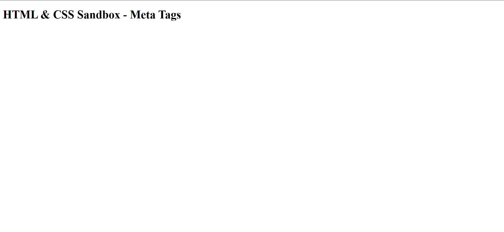

# HTML & CSS Sandbox - Meta Tags

This project demonstrates the basic usage of **HTML Meta Tags** inside the `<head>` section of an HTML document.  
It is part of the **Essential HTML** section from the HTML & CSS learning sandbox.

---

## 📌 Project Overview

The project includes:

- Character encoding using UTF-8
- Responsive viewport setup
- SEO-friendly description meta tag
- Keywords meta tag
- Proper HTML5 document structure

This project helps beginners understand how metadata works in HTML and how search engines read webpage information.

---



## 🚀 Technologies Used

- HTML5

---

## 📂 Project Structure

```bash
01-meta-tags/
│
├── index.html
├── README.md
│
└── images/
    └── output.png
```
