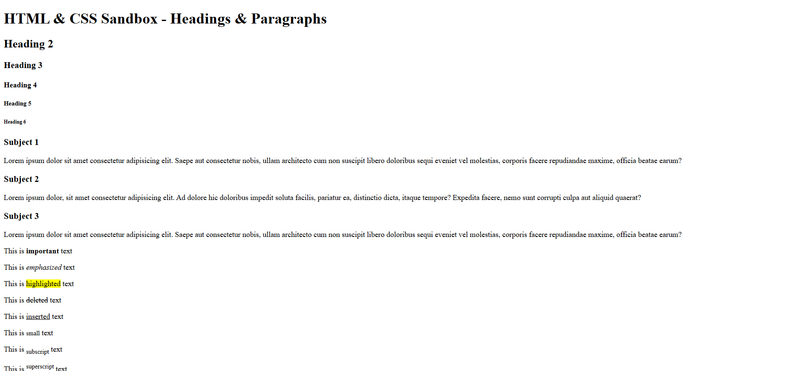

# HTML & CSS Sandbox - Headings & Paragraphs

This project demonstrates the usage of different **HTML Heading Tags**, **Paragraphs**, and common **Text Formatting Elements** in HTML5.  
It is part of the **Essential HTML** section from the HTML & CSS learning sandbox.

---

## 📌 Project Overview

The project includes:

- HTML heading tags from `<h1>` to `<h6>`
- Paragraph creation using `<p>`
- Text emphasis and formatting elements
- Semantic text styling tags
- Basic HTML content structuring

This project helps beginners understand how textual content is structured and formatted in HTML.

---



---

## 🚀 Technologies Used

- HTML5

---

## 📂 Project Structure

```bash
02-headings-paragraphs/
│
├── index.html
├── README.md
└── output.png
```
