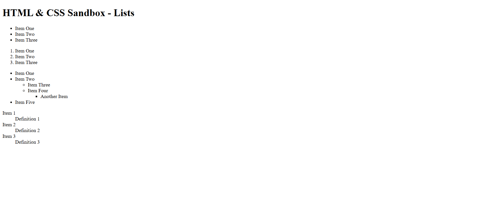

# HTML & CSS Sandbox - Lists

This project demonstrates different types of **HTML Lists** including unordered lists, ordered lists, nested lists, and definition lists.  
It is part of the **Essential HTML** section from the HTML & CSS learning sandbox.

---

## 📌 Project Overview

The project includes:

- Unordered Lists (`<ul>`)
- Ordered Lists (`<ol>`)
- Nested Lists
- Definition Lists (`<dl>`)
- List items using `<li>`
- Terms and definitions using `<dt>` and `<dd>`

This project helps beginners understand how structured data and grouped content are displayed in HTML.

---



---

## 🚀 Technologies Used

- HTML5

---

## 📂 Project Structure

```bash
03-lists/
│
├── index.html
├── README.md
└── output.png
```
