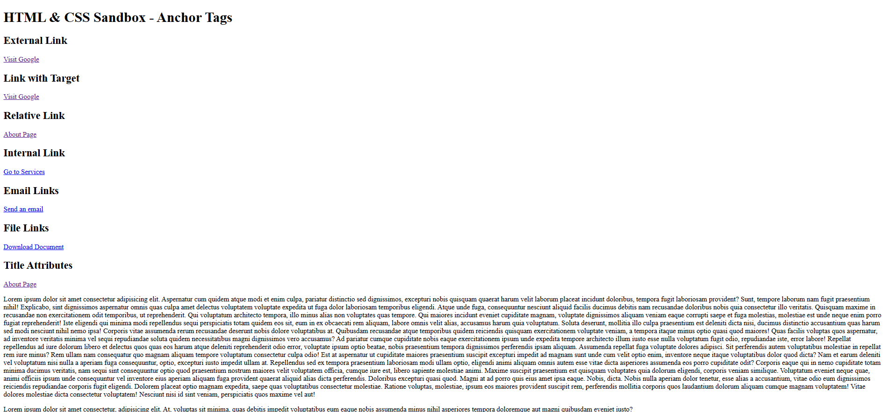

# HTML & CSS Sandbox - Anchor Tags

This project demonstrates the usage of different types of **HTML Anchor Tags (`<a>`)** including external links, internal links, relative links, email links, file downloads, and title attributes.  
It is part of the **Essential HTML** section from the HTML & CSS learning sandbox.

---

## Project Overview

The project includes:

- External website links
- Opening links in a new tab
- Relative page navigation
- Internal page linking using IDs
- Email links using `mailto:`
- File download links
- Title attributes for additional information

This project helps beginners understand how navigation and linking work in HTML webpages.

---



---

## Technologies Used

- HTML5

---

## 📂 Project Structure

```bash
04-anchor-tags/
│
├── index.html
├── about.html
├── invoice.pdf
├── README.md
└── output.png
```
