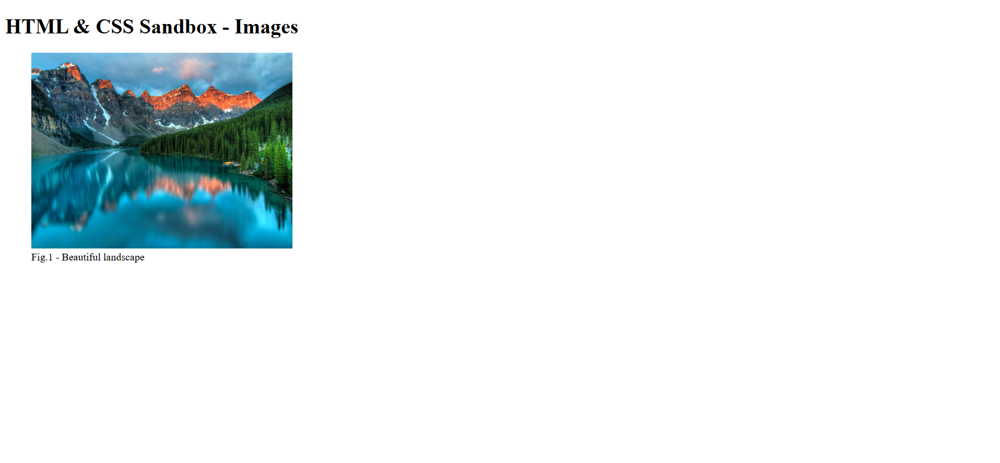

# HTML & CSS Sandbox - Images

This project demonstrates how to work with **Images in HTML** using the ``, `<figure>`, and `<figcaption>` elements.  
It is part of the **Essential HTML** section from the HTML & CSS learning sandbox.

---

## Project Overview

The project includes:

- Displaying images using relative paths
- Using absolute image URLs
- Setting image width and height
- Adding alternative text with `alt`
- Adding image titles
- Using semantic `<figure>` and `<figcaption>` elements

This project helps beginners understand how images are embedded and structured in modern HTML webpages.

---



---

## Technologies Used

- HTML5

---

## 📂 Project Structure

```bash
05-images/
│
├── index.html
├── README.md
├── output.png
│
└── images/
    └── landscape.jpg
```
