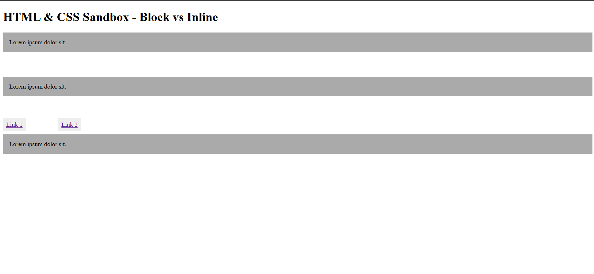

# HTML & CSS Sandbox - Block vs Inline Elements

This project demonstrates the difference between **Block-Level Elements** and **Inline Elements** in HTML using simple styling examples.  
It is part of the **Essential HTML** section from the HTML & CSS learning sandbox.

---

## Project Overview

The project includes:

- Block-level elements using `<p>`
- Inline elements using `<a>`
- Basic CSS styling
- Spacing using padding and margin
- Understanding element display behavior

This project helps beginners understand how different HTML elements behave inside webpage layouts.

---



---

## Technologies Used

- HTML5
- CSS3

---

## 📂 Project Structure

```bash
06-block-inline-elements/
│
├── index.html
├── README.md
└── output.png
```
