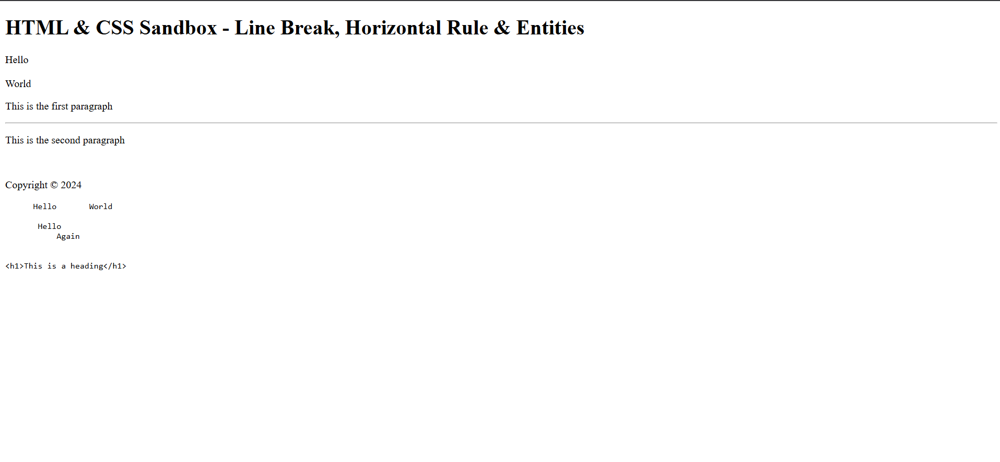

# HTML & CSS Sandbox - Line Break, Horizontal Rule & Entities

This project demonstrates the usage of HTML elements like **Line Breaks (`<br>`)**, **Horizontal Rules (`<hr>`)**, **Preformatted Text (`<pre>`)**, **Code Tags (`<code>`)**, and common **HTML Entities**.  
It is part of the **Essential HTML** section from the HTML & CSS learning sandbox.

---

## Project Overview

The project includes:

- Line breaks using `<br>`
- Horizontal rules using `<hr>`
- Preformatted text using `<pre>`
- Displaying code snippets using `<code>`
- HTML entities for special characters
- Reserved symbol rendering in HTML

This project helps beginners understand how spacing, formatting, and special characters work in HTML documents.

---



---

## Technologies Used

- HTML5

---

## 📂 Project Structure

```bash
07-br-hr-entities/
│
├── index.html
├── README.md
└── output.png
```
