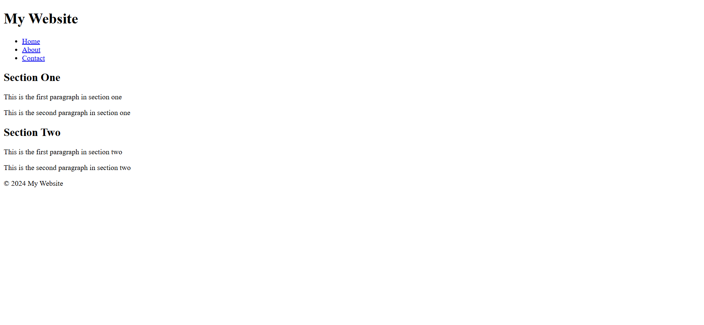

# HTML & CSS Sandbox - Divs & Spans

This project demonstrates the usage of **`<div>`** and **`<span>`** elements in HTML for structuring and grouping webpage content.  
It is part of the **Essential HTML** section from the HTML & CSS learning sandbox.

---

## Project Overview

The project includes:

- Website layout structure using `<div>`
- Inline text grouping using `<span>`
- Basic webpage sections
- Navigation links
- Header, content, and footer sections

This project helps beginners understand the difference between block-level and inline grouping elements in HTML.

---



---

## Technologies Used

- HTML5

---

## 📂 Project Structure

```bash
08-divs-and-spans/
│
├── index.html
├── README.md
└── output.png
```
