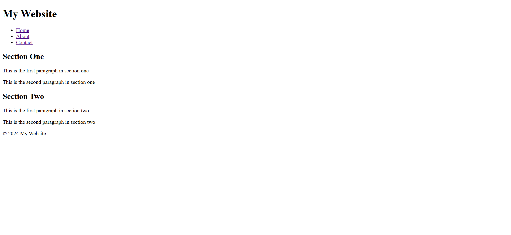

# HTML & CSS Sandbox - Semantic Elements

This project demonstrates the usage of modern **HTML Semantic Elements** for creating structured and meaningful webpage layouts.  
It is part of the **Essential HTML** section from the HTML & CSS learning sandbox.

---

## Project Overview

The project includes:

- Semantic layout structure
- Header and navigation sections
- Main content areas
- Content sections
- Footer section
- Improved webpage readability and accessibility

This project helps beginners understand how semantic HTML improves webpage structure, SEO, and accessibility.

---



---

## Technologies Used

- HTML5

---

## 📂 Project Structure

```bash
10-semantic-elements/
│
├── index.html
├── README.md
└── output.png
```
