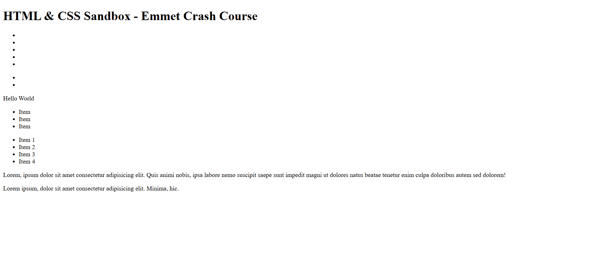

# HTML & CSS Sandbox - Emmet Crash Course

This project demonstrates the usage of **Emmet Abbreviations** for writing HTML faster and more efficiently inside code editors like VS Code.  
It is part of the **Essential HTML** section from the HTML & CSS learning sandbox.

---

## Project Overview

The project includes:

- Basic Emmet syntax
- Class and ID generation
- Nested element creation
- Multiple element generation
- Text content shortcuts
- Lorem ipsum generation
- Anchor and script tag shortcuts

This project helps beginners improve development speed by learning Emmet shorthand techniques.

---



---

## Technologies Used

- HTML5
- Emmet Abbreviations
- VS Code

---

## 📂 Project Structure

```bash
11-emmet-crash-course/
│
├── index.html
├── README.md
└── output.png
```
