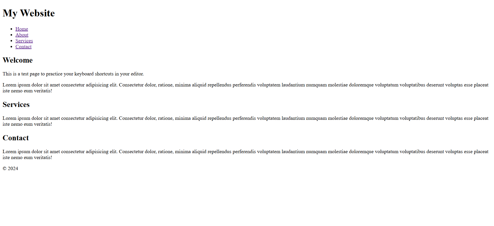

# HTML & CSS Sandbox - Editor Shortcuts

This project demonstrates a simple multi-section webpage built while practicing **Editor Keyboard Shortcuts** and efficient HTML editing workflows.  
It is part of the **Essential HTML** section from the HTML & CSS learning sandbox.

---

## Project Overview

The project includes:

- Website header and navigation
- Multiple content sections
- Footer section
- Semantic HTML structure
- Fast HTML editing practice
- Productivity-focused coding workflow

This project helps beginners improve coding speed and efficiency by using editor shortcuts while building webpage layouts.

---



---

## Technologies Used

- HTML5
- VS Code Editor Shortcuts

---

## 📂 Project Structure

```bash
12-editor-shortcuts/
│
├── index.html
├── README.md
└── output.png
```
