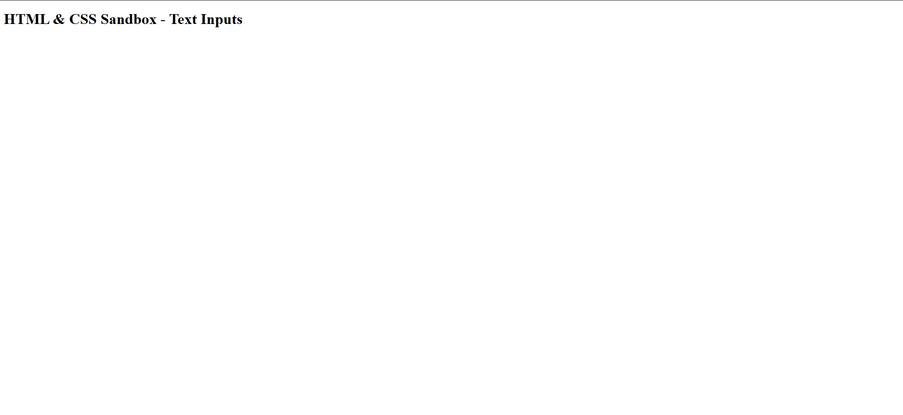

# HTML & CSS Sandbox - Text Based Inputs

This project introduces **Text-Based Form Inputs** in HTML and serves as the starting point of the **Forms & Inputs** section from the HTML & CSS learning sandbox.

The project focuses on understanding how user input fields are structured in HTML forms.

---

## Project Overview

The project is prepared for practicing:

- HTML form structures
- Text-based input fields
- User data collection
- Form accessibility basics
- Input-related HTML elements

This section builds the foundation for creating interactive web forms.

---



---

## Technologies Used

- HTML5

---

## 📂 Project Structure

```bash
01-text-based-inputs/
│
├── index.html
├── README.md
└── output.png
```
