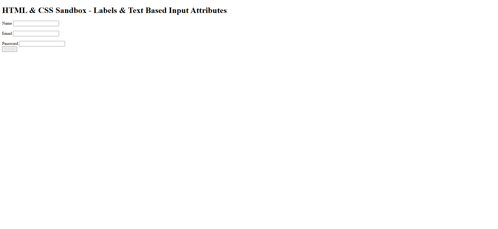

# HTML & CSS Sandbox - Labels & Text Based Input Attributes

This project demonstrates how to use **HTML Labels** and various **Text-Based Input Attributes** inside forms.  
It is part of the **Forms & Inputs** section from the HTML & CSS learning sandbox.

The project focuses on improving form accessibility, usability, and user interaction.

---

## Project Overview

The project includes:

- Form labels using `<label>`
- Text input fields
- Email input fields
- Password input fields
- Submit buttons
- Form accessibility practices

This project helps beginners understand how labels and input attributes improve the overall form experience.

---



---

## Technologies Used

- HTML5

---

## 📂 Project Structure

```bash
02-labels-text-input-attributes/
│
├── index.html
├── README.md
└── output.png
```
