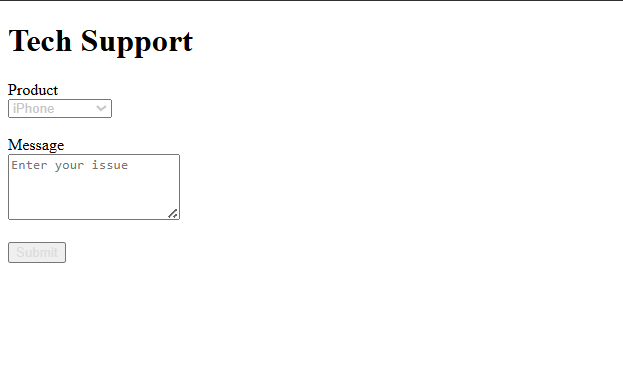

# HTML & CSS Sandbox - Select & Textarea

This project demonstrates the usage of **Select Dropdowns** and **Textarea Fields** in HTML forms.  
It is part of the **Forms & Inputs** section from the HTML & CSS learning sandbox.

The project simulates a simple tech support form where users can select a product and describe their issue.

---

## Project Overview

The project includes:

- Dropdown menus using `<select>`
- Multiple selectable options using `<option>`
- Multi-line text input using `<textarea>`
- Form labels
- Submit button functionality
- Basic form structure

This project helps beginners understand how user selections and long-form text inputs work in HTML forms.

---



---

## Technologies Used

- HTML5

---

## 📂 Project Structure

```bash
03-select-and-textarea/
│
├── index.html
├── README.md
└── output.png
```
