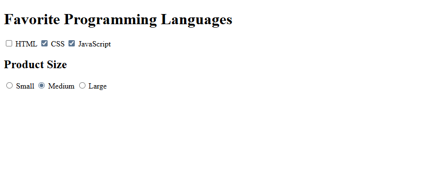

# HTML & CSS Sandbox - Checkboxes & Radio Buttons

This project demonstrates the usage of **Checkboxes** and **Radio Buttons** in HTML forms.  
It is part of the **Forms & Inputs** section from the HTML & CSS learning sandbox.

The project allows users to select favorite programming languages and choose a product size option.

---

## Project Overview

The project includes:

- Checkbox inputs
- Radio button inputs
- Grouped form selections
- Default checked inputs
- Labels for accessibility
- Multiple and single-choice selections

This project helps beginners understand how different input selection types work in HTML forms.

---



---

## Technologies Used

- HTML5

---

## 📂 Project Structure

```bash
04-checkboxes-and-radio/
│
├── index.html
├── README.md
└── output.png
```
