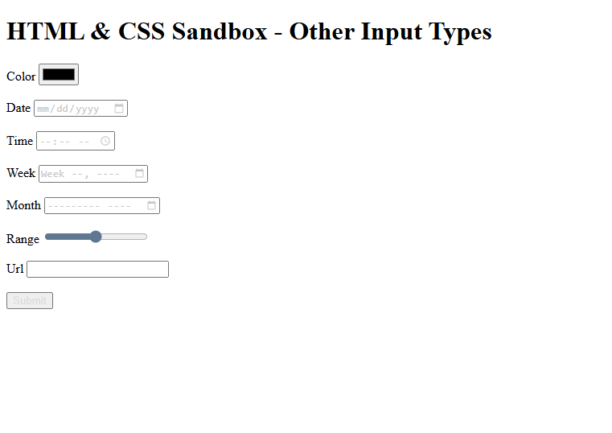

# HTML & CSS Sandbox - Other Input Types

This project demonstrates various modern **HTML Input Types** used in forms for collecting specialized user data.  
It is part of the **Forms & Inputs** section from the HTML & CSS learning sandbox.

The project showcases interactive input elements like color pickers, date selectors, range sliders, and URL inputs.

---

## Project Overview

The project includes:

- Color picker input
- Date input
- Time input
- Week input
- Month input
- Range slider input
- URL input
- Submit button

This project helps beginners understand how different HTML input types improve user experience and form functionality.

---



---

## Technologies Used

- HTML5

---

## 📂 Project Structure

```bash
05-other-input-types/
│
├── index.html
├── README.md
└── output.png
```
