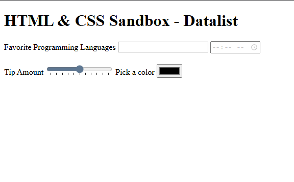

# HTML & CSS Sandbox - Datalist

This project demonstrates the usage of the **HTML `<datalist>` element** for creating predefined suggestion lists for form inputs.  
It is part of the **Forms & Inputs** section from the HTML & CSS learning sandbox.

The project showcases datalist integration with text inputs, time inputs, range sliders, and color pickers.

---

## Project Overview

The project includes:

- Datalist suggestions
- Input autocomplete functionality
- Programming language suggestions
- Time suggestion lists
- Range slider tick marks
- Color picker suggestions

This project helps beginners understand how datalists improve form usability and user interaction.

---



---

## Technologies Used

- HTML5

---

## 📂 Project Structure

```bash
06-datalist/
│
├── index.html
├── README.md
└── output.png
```
