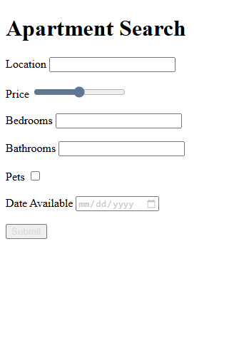

# HTML & CSS Sandbox - HTML Form Challenge

This project demonstrates a complete **HTML Form Challenge** by building an apartment search form with multiple input types.  
It is part of the **Forms & Inputs** section from the HTML & CSS learning sandbox.

The project simulates a real-world apartment search form where users can enter search preferences and property details.

---

## Project Overview

The project includes:

- Text inputs
- Range sliders
- Number inputs
- Checkbox inputs
- Date inputs
- Submit buttons
- Form labels and structure

This project helps beginners combine multiple HTML form elements into a practical real-world form layout.

---



---

## Technologies Used

- HTML5

---

## 📂 Project Structure

```bash
07-html-form-challenge/
│
├── index.html
├── README.md
└── output.png
```
