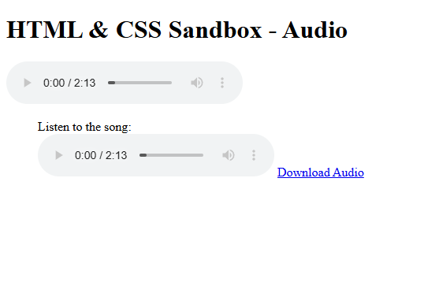

# HTML & CSS Sandbox - Audio Element

This project demonstrates the usage of the **HTML Audio Element (`<audio>`)** for embedding and controlling audio playback inside webpages.  
It is part of the **More HTML Elements** section from the HTML & CSS learning sandbox.

The project includes audio playback controls, looping audio, downloadable audio files, and semantic media structure using `<figure>` and `<figcaption>`.

---

## Project Overview

The project includes:

- Audio playback using `<audio>`
- Audio controls
- Looping audio playback
- Audio download links
- Multiple audio implementation methods
- Semantic media structure using `<figure>`

This project helps beginners understand how audio media is embedded and controlled in HTML webpages.

---



---

## Technologies Used

- HTML5
- MP3 Audio Files

---

## 📂 Project Structure

```bash
01-audio-element/
│
├── index.html
├── song1.mp3
├── README.md
└── output.png
```
