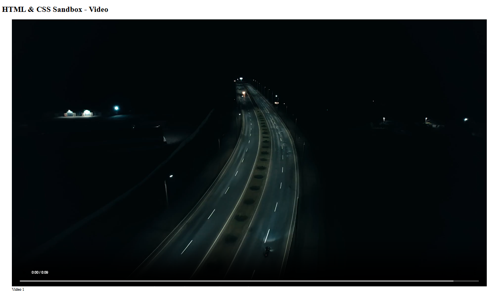

# HTML & CSS Sandbox - Video Element

This project demonstrates the usage of the **HTML Video Element (`<video>`)** for embedding and controlling video playback inside webpages.  
It is part of the **More HTML Elements** section from the HTML & CSS learning sandbox.

The project includes video playback controls, autoplay examples, looping videos, muted playback, and semantic media structure using `<figure>` and `<figcaption>`.

---

## Project Overview

The project includes:

- Video playback using `<video>`
- Video controls
- Autoplay video examples
- Looping video playback
- Muted video playback
- Semantic media structure using `<figure>`

This project helps beginners understand how videos are embedded and managed in HTML webpages.

---



---

## Technologies Used

- HTML5
- MOV Video Files

---

## 📂 Project Structure

```bash
02-video-element/
│
├── index.html
├── video1.mov
├── README.md
└── output.png
```
