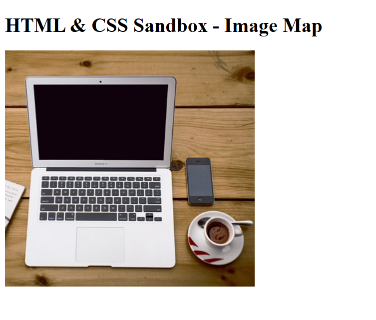

# HTML & CSS Sandbox - Image Map

This project demonstrates the usage of **HTML Image Maps** using the `<map>` and `<area>` elements.  
It is part of the **More HTML Elements** section from the HTML & CSS learning sandbox.

The project creates clickable areas inside an image where different sections of the image can link to different webpages.

---

## sProject Overview

The project includes:

- Image mapping using `<map>`
- Clickable image regions
- Rectangle-shaped clickable areas
- Circle-shaped clickable areas
- Coordinate-based mapping
- Interactive image navigation

This project helps beginners understand how image maps work and how specific image areas can become interactive links.

---



---

## Technologies Used

- HTML5
- Image Maps
- JPG Images

---

## 📂 Project Structure

```bash
03-image-map/
│
├── index.html
├── computer.jpg
├── README.md
└── output.png
```
