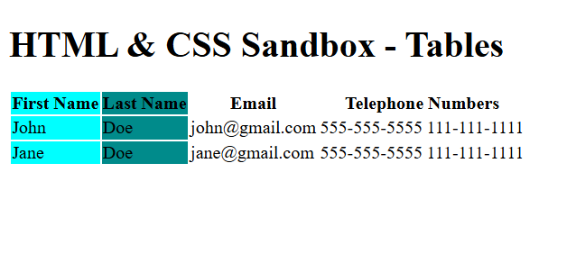

# HTML & CSS Sandbox - Tables

This project demonstrates the usage of **HTML Tables** for organizing and displaying structured tabular data.  
It is part of the **More HTML Elements** section from the HTML & CSS learning sandbox.

The project includes table headers, table rows, column grouping, and merged table columns.

---

## Project Overview

The project includes:

- Table creation using `<table>`
- Table headers using `<thead>`
- Table body using `<tbody>`
- Table rows and cells
- Column grouping using `<colgroup>`
- Merged columns using `colspan`

This project helps beginners understand how structured data is displayed in HTML tables.

---



---

## Technologies Used

- HTML5

---

## 📂 Project Structure

```bash
04-tables/
│
├── index.html
├── README.md
└── output.png
```
