# HTML & CSS Crash Course - BSS Internship

> A comprehensive documentation of my complete HTML & CSS learning journey through the Bangladesh Software Solution (BSS) Internship program.

## Table of Contents

- [About This Course](#about-this-course)
- [Course Structure](#course-structure)
- [Projects](#projects)
  - [Bono Landing Form](#bono-landing-form)
  - [Lumina Creative](#lumina-creative)
  - [Lumina Creative Grid](#lumina-creative-grid)
  - [Tutor Website](#tutor-website)
  - [Leno Website](#leno-website)
  - [BSSHive (Bonus)](#bsshive-bonus)
  - [Nexora AI (Bonus)](#nexora-ai-bonus)
- [Technologies Used](#technologies-used)
- [Author](#author)
- [License](#license)

---

## About This Course

This repository contains all the projects and learning modules from my HTML & CSS crash course completed during my internship at Bangladesh Software Solution (BSS). The course covered everything from basic HTML semantics to advanced CSS techniques including Flexbox, Grid, responsive design, animations, and accessibility.

**Total Sections:** 12  
**Total Projects:** 7 (including bonuses)  
**Duration:** Intensive self-paced learning  
**Status:** Completed ✅

---

## Course Structure

### 01-Essential-HTML

- Meta tags and search engines
- Headings and paragraphs
- Lists (ordered, unordered, description)
- Anchor tags and links
- Images and alt attributes
- Block vs inline elements
- BR, HR, and HTML entities
- Divs and spans
- Classes and IDs
- Semantic HTML elements
- Emmet crash course
- Editor shortcuts

### 02-Forms-and-Inputs

- Text-based inputs (text, email, password)
- Text input attributes (placeholder, required, pattern)
- Select dropdowns and textareas
- Checkboxes and radio buttons
- Other input types (date, color, range, file)
- Datalist element
- HTML form challenge

### 03-More-HTML-Elements

- Additional HTML5 elements
- Tables and data presentation
- Multimedia elements
- iframe integration

### 04-CSS-Basics

- Implementing CSS (inline, internal, external)
- Basic selectors (element, class, ID, universal)
- System fonts vs web fonts
- Font and text properties
- Colors (hex, rgb, rgba, hsl, hsla)
- Inheritance and specificity
- Backgrounds and background images
- Styling links
- Font Awesome icons
- CSS basics challenge

### 05-Box-Model-and-Positioning

- Sizing and overflow
- Padding and margin
- Universal selector and CSS reset
- Border properties
- Display property (block, inline, inline-block, none)
- Positioning (static, relative, absolute, fixed, sticky)
- Box shadow
- Freelance form challenge
- Shoe cards project

### 06-Flexbox

- Flex container and items
- Align and justify properties
- Flex properties (flex-grow, flex-shrink, flex-basis)
- Flex order
- Flexbox layout challenge
- Pricing grid project

### 07-Responsive-Media-Queries

- Percentages in responsive design
- REM and EM units
- VH and VW units
- Media queries (breakpoints)
- Responsive pricing grid
- Responsive flexbox layout
- Container queries
- Container units

### 08-Various-CSS-Features

- Custom properties (CSS variables)
- Filters (blur, brightness, contrast, etc.)
- Smooth scrolling
- Sticky navbar
- Calc function
- CSS nesting

### 09-Web-Accessibility-Introduction

- Screen reader testing
- Role attribute
- ARIA attributes
- ARIA expanded and dynamic elements

### 10-Advanced-Selectors

- Attribute selectors
- Child and sibling combinators
- Pseudo-elements (::before, ::after)
- Nth-child classes
- Nth-of-type classes
- Image overlay effects
- :is() and :has() selectors
- Selectors challenge

### 11-CSS-Grid

- Grid columns and rows
- Repeat and minmax functions
- Grid challenges
- Autofill and autofit
- Align and justify in grid
- Positioning and spanning items
- Named grid lines
- Grid template and autoflow
- Grid and media queries
- Grid template areas

### 12-Transitions-Animations-JS

- Creating transitions
- Transforms (translate, rotate, scale, skew)
- Absolute centering with translate
- 3D transforms
- JavaScript and CSS interaction
- Hamburger menu with JS
- Keyframes animations
- 3D rotating cube
- Presentation website

---

## Projects

### Bono Landing Form

A modern landing page for the Bono web app featuring a contact form with gradient background and responsive design.

**Features:**

- Responsive gradient background (red to purple)
- Contact form with validation
- Modern UI/UX design
- Mobile-responsive layout

**Technologies:** HTML5, CSS3, Flexbox, Media Queries

**GitHub Repository:** [View Code](https://github.com/Adib5947/HTML-CSS-BSS-Internship/tree/master/bono-landing-form)

**Screenshot:**
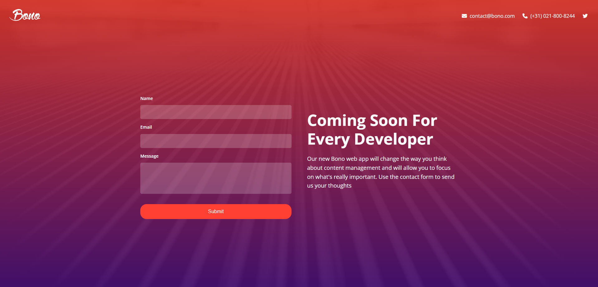

---

### Lumina Creative

A modern responsive multi-page portfolio website for a creative agency showcasing photography, web design, and graphic design services.

**Features:**

- Multi-page website (Home, About, Contact)
- Interactive image gallery with Lightbox.js
- Flexbox-based layouts
- Responsive design for all devices
- Team showcase section

**Technologies:** HTML5, CSS3, Flexbox, Lightbox2, Font Awesome, Google Fonts

**Live Demo:** https://lumina-creative-adib.vercel.app/

**GitHub Repository:** [View Code](https://github.com/Adib5947/HTML-CSS-BSS-Internship/tree/master/lumina-creative)

**Screenshots:**

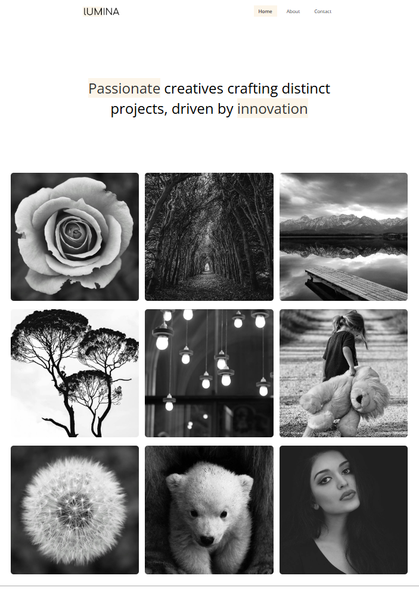
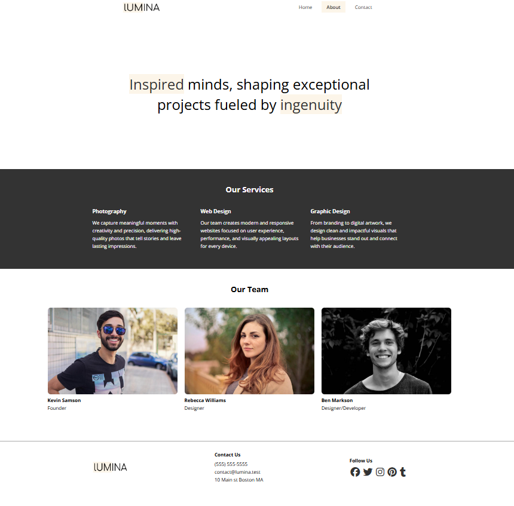
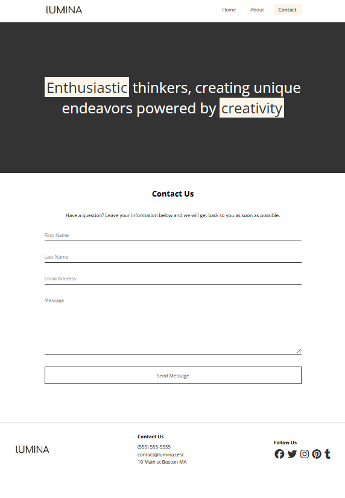

---

### Lumina Creative Grid

An upgraded version of Lumina Creative utilizing CSS Grid for more advanced and flexible layouts.

**Features:**

- CSS Grid gallery layout
- Asymmetric portfolio design
- Responsive grid system
- Enhanced layout flexibility

**Technologies:** HTML5, CSS3, CSS Grid, Flexbox, Lightbox2, Font Awesome

**GitHub Repository:** [View Code](https://github.com/Adib5947/HTML-CSS-BSS-Internship/tree/master/lumina-creative-grid)

**Screenshots:**

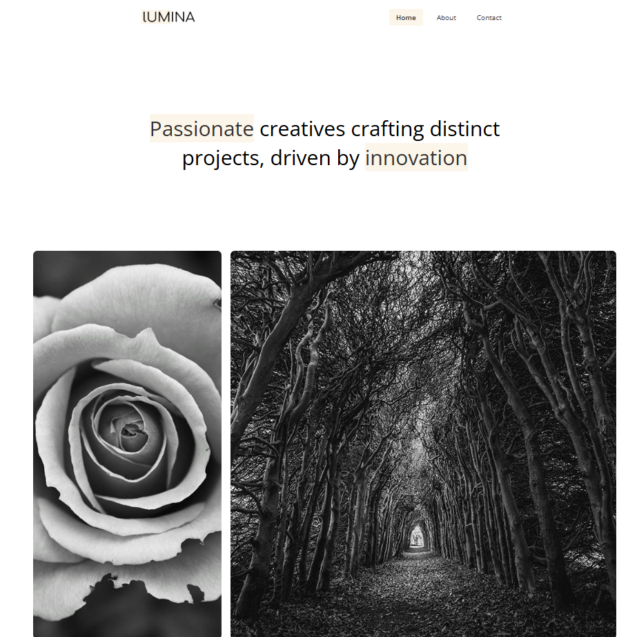
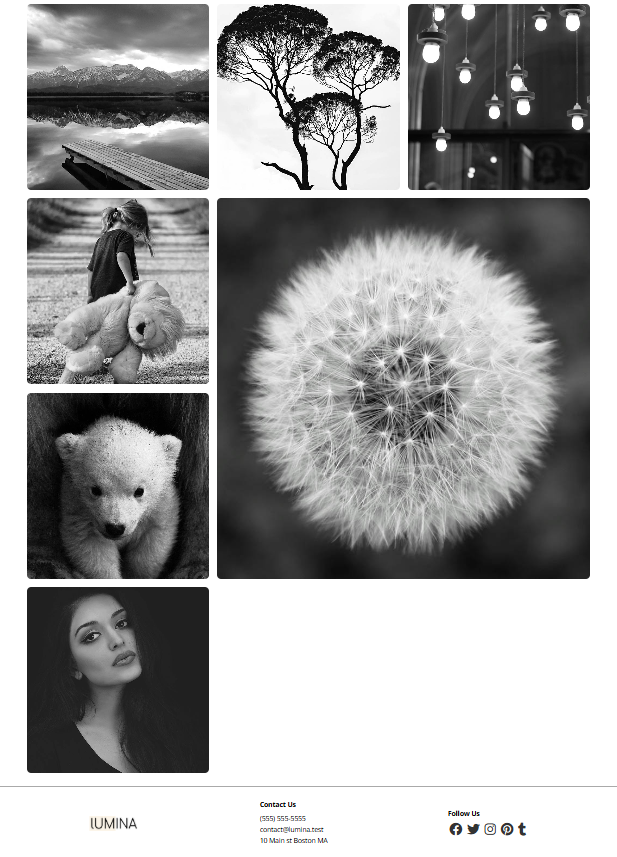

---

### Tutor Website

A modern and responsive video course landing page built to showcase online educational content.

**Features:**

- Responsive landing page design
- Smooth scrolling navigation
- Mobile navigation menu
- Course chapters section
- Course summary and takeaways
- Author information section
- Newsletter subscription form
- Contact page with Formspree integration

**Technologies:** HTML5, CSS3, JavaScript (Vanilla), Font Awesome, Google Fonts, Formspree

**Live Demo:** https://tutor-website-adib.vercel.app/

**GitHub Repository:** [View Code](https://github.com/Adib5947/HTML-CSS-BSS-Internship/tree/master/tutor-website)

**Screenshots:**

---

### Leno Website

A modern and responsive landing page for a productivity & health mobile application.

**Features:**

- Modern responsive UI design
- Smooth navigation & mobile menu
- Interactive video preview modal
- Beautiful hero section
- Features & highlights section
- Testimonials section
- App screenshots gallery
- Pricing plans section

**Technologies:** HTML5, CSS3, Vanilla JavaScript, Font Awesome, Google Fonts

**Live Demo:** https://leno-website-adib.vercel.app/

**GitHub Repository:** [View Code](https://github.com/Adib5947/HTML-CSS-BSS-Internship/tree/master/leno-website)

**Screenshots:**

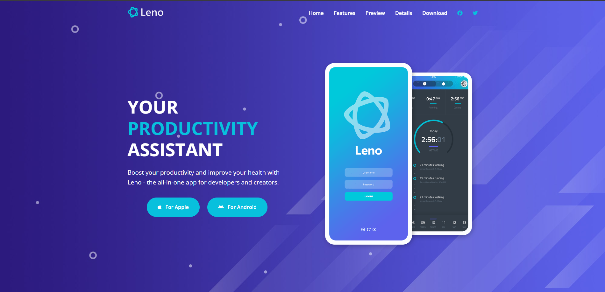
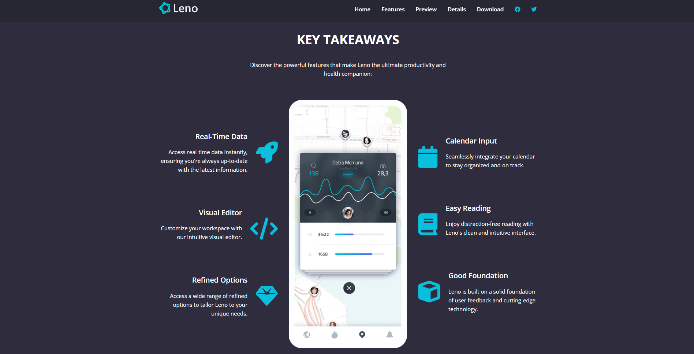
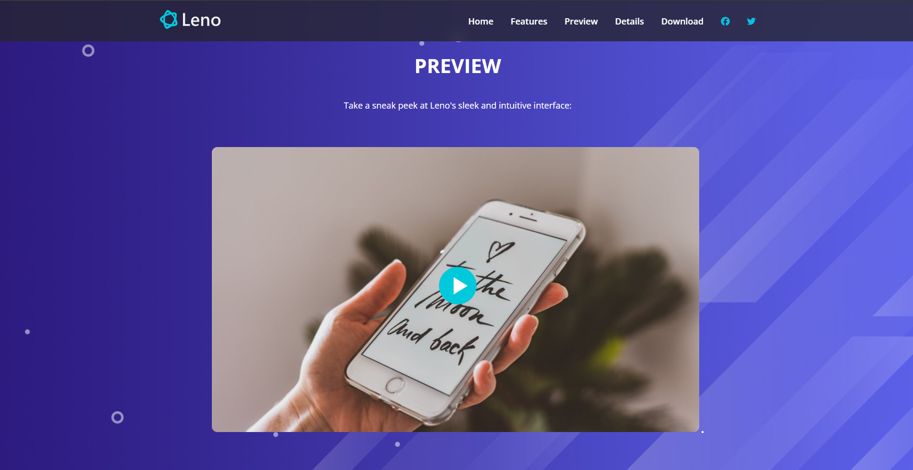
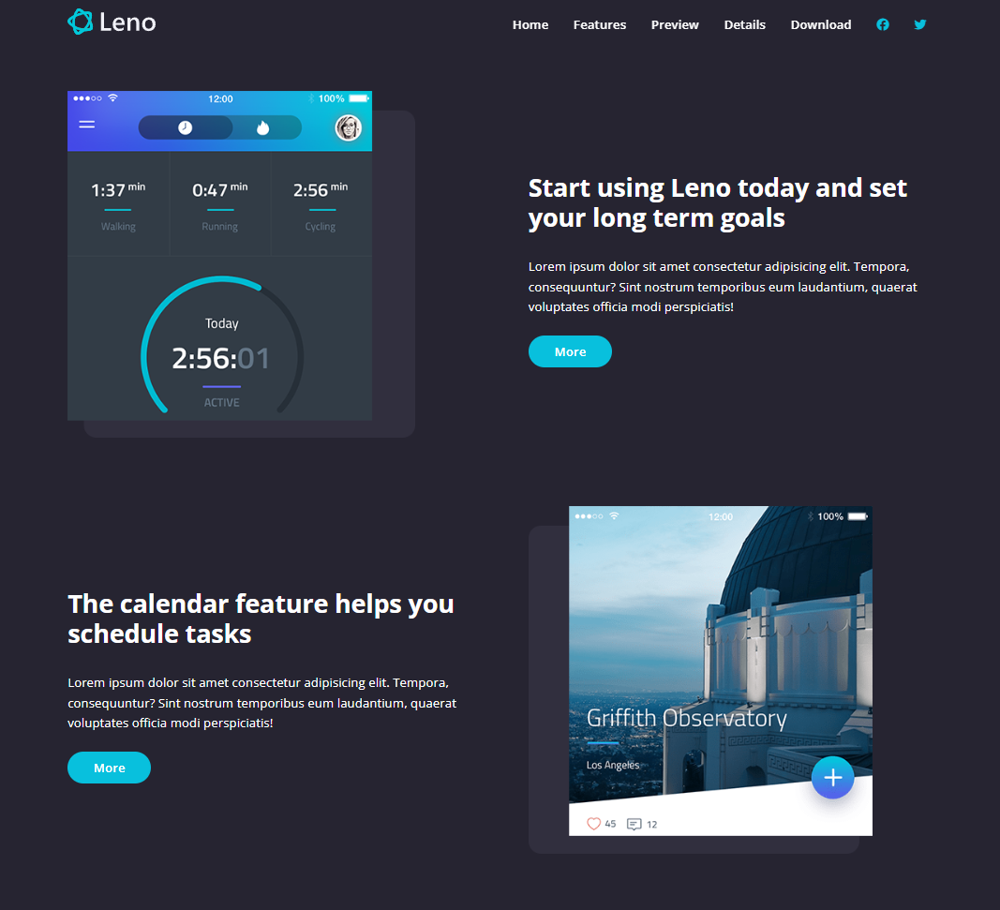
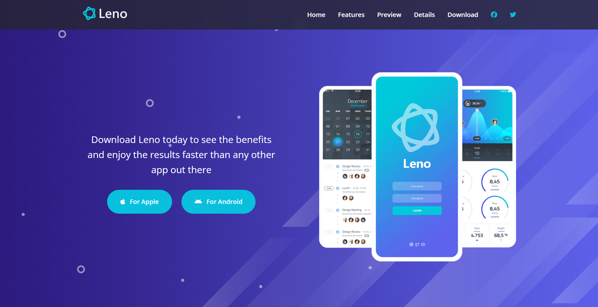
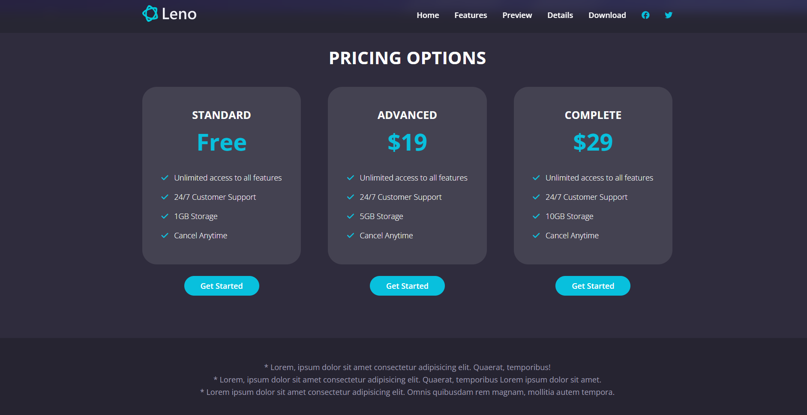

---

### BSSHive (Bonus)

A modern and responsive business course landing page with premium black-and-yellow branding.

**Features:**

- Fully responsive website
- Modern premium UI/UX
- Black & yellow branding theme
- Mobile navigation menu
- Business course showcase
- Newsletter subscription UI
- Embedded Google Maps
- Contact form integration

**Technologies:** HTML5, CSS3, JavaScript (Vanilla), Font Awesome, Google Fonts, Formspree, Google Maps Embed API

**Live Demo:** https://bsshive.vercel.app/

**GitHub Repository:** [View Code](https://github.com/Adib5947/HTML-CSS-BSS-Internship/tree/master/tutor-website/Bonus/bsshive-website)

**Screenshots:**

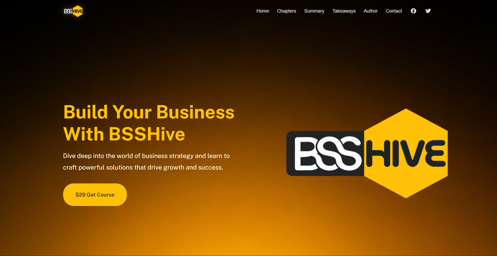
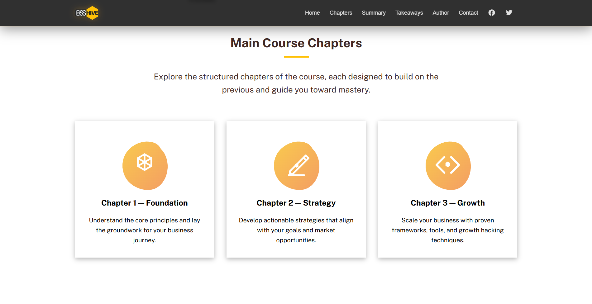
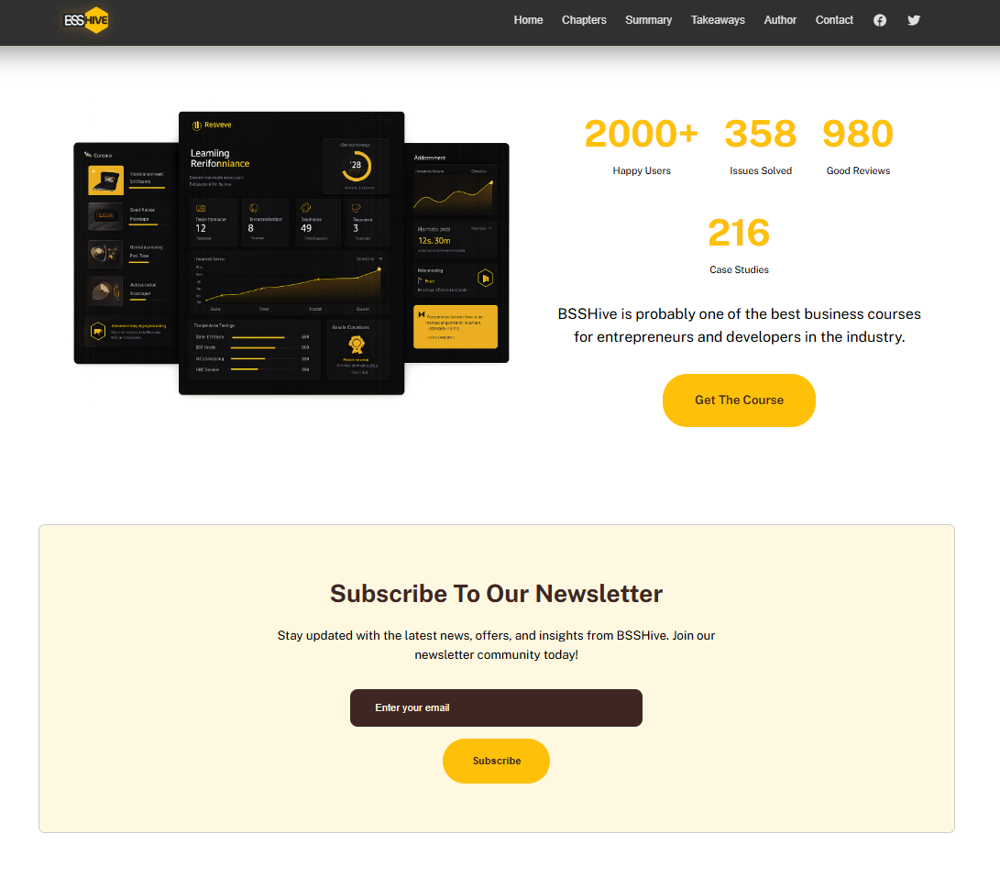
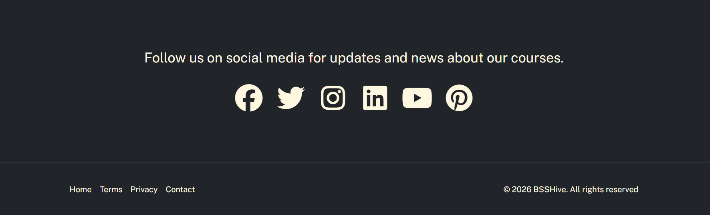

---

### Nexora AI (Bonus)

A futuristic and responsive AI workspace landing page built for developers, creators, and startups.

**Features:**

- Futuristic AI-inspired UI design
- Fully responsive website
- Sticky navbar with scroll effects
- Mobile hamburger navigation
- Interactive video preview modal
- AI workspace hero section
- Smart workflow showcase
- Dashboard & analytics UI
- Pricing plans section

**Technologies:** HTML5, CSS3, Vanilla JavaScript, Google Fonts, Font Awesome Icons, Custom Gradient Effects, Responsive Flexbox & Grid Layouts

**GitHub Repository:** [View Code](<https://github.com/Adib5947/HTML-CSS-BSS-Internship/tree/master/leno-website/Bonus%20(Nexora%20AI)/nexora_ai-website>)

**Screenshots:**
/nexora_ai-website/home.png>)
/nexora_ai-website/features.png>)
/nexora_ai-website/preview.png>)
/nexora_ai-website/pricing.png>)

---

## Technologies Used

### Frontend Development

- **HTML5** - Semantic markup and structure
- **CSS3** - Styling and layout
- **JavaScript (Vanilla)** - Interactivity and DOM manipulation

### CSS Features

- **Flexbox** - One-dimensional layouts
- **CSS Grid** - Two-dimensional layouts
- **CSS Custom Properties** - Variables for theming
- **Media Queries** - Responsive design
- **Container Queries** - Modern responsive techniques
- **Animations & Transitions** - Smooth interactions
- **Transforms** - 2D and 3D transformations

### External Libraries & Tools

- **Font Awesome** - Icon library
- **Google Fonts** - Web typography
- **Lightbox2** - Image gallery plugin
- **Formspree** - Form handling service
- **Google Maps Embed API** - Map integration

---

## Skills Developed

### Technical Skills

✅ Writing semantic and accessible HTML  
✅ Mastering CSS selectors and specificity  
✅ Building responsive layouts with Flexbox and Grid  
✅ Implementing mobile-first design  
✅ Creating smooth animations and transitions  
✅ Using CSS custom properties for maintainability  
✅ Integrating JavaScript for interactivity  
✅ Ensuring web accessibility compliance

### Projects Completed

✅ 12 comprehensive HTML & CSS modules  
✅ 7+ real-world projects in portfolio  
✅ Responsive and accessible web development  
✅ Modern CSS techniques mastery

---

## Author

**Adib Ahmed**  
AI Engineer Intern  
Bangladesh Software Solution (BSS)

**LinkedIn:** https://linkedin.com/in/adib191/
**GitHub:** https://github.com/Adib5947  
**Location:** Bangladesh 🇧🇩

**Passionate about:**

- Web Development
- Artificial Intelligence & Machine Learning
- Frontend Design
- Building Modern Responsive Websites
- Open Source Contributions

---

## Acknowledgments

Special thanks to:

- **Bangladesh Software Solution (BSS)** for this amazing internship opportunity
- **Mentors and Instructors** for guidance and support
- **MDN Web Docs** and **CSS-Tricks** for excellent documentation
- **Open Source Community** for tools and libraries used in this course

---

## License

This course material and projects are open-source and available under the **MIT License**.

Copyright (c) 2026 Adib Ahmed

Permission is hereby granted, free of charge, to any person obtaining a copy
of this software and associated documentation files (the "Software"), to deal
in the Software without restriction, including without limitation the rights
to use, copy, modify, merge, publish, distribute, sublicense, and/or sell
copies of the Software, and to permit persons to whom the Software is
furnished to do so, subject to the following conditions:

The above copyright notice and this permission notice shall be included in all
copies or substantial portions of the Software.

THE SOFTWARE IS PROVIDED "AS IS", WITHOUT WARRANTY OF ANY KIND, EXPRESS OR
IMPLIED, INCLUDING BUT NOT LIMITED TO THE WARRANTIES OF MERCHANTABILITY,
FITNESS FOR A PARTICULAR PURPOSE AND NONINFRINGEMENT. IN NO EVENT SHALL THE
AUTHORS OR COPYRIGHT HOLDERS BE LIABLE FOR ANY CLAIM, DAMAGES OR OTHER
LIABILITY, WHETHER IN AN ACTION OF CONTRACT, TORT OR OTHERWISE, ARISING FROM,
OUT OF OR IN CONNECTION WITH THE SOFTWARE OR THE USE OR OTHER DEALINGS IN THE
SOFTWARE.

---

## Contact

For questions, feedback, or collaboration opportunities:

- **GitHub Issues:** Open an issue on any project repository
- **GitHub Profile:** https://github.com/Adib5947

---

**Course Completed:** May 2026  
**Total Projects:** 7 (including bonuses)  
**Total Sections:** 12

**Happy Coding!**
