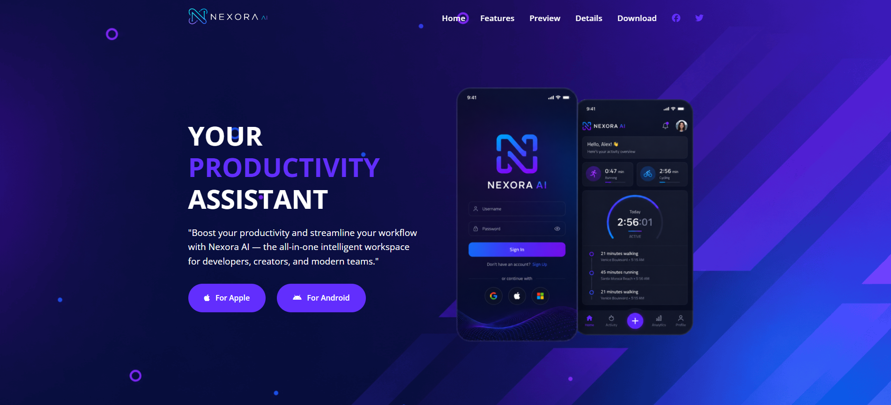
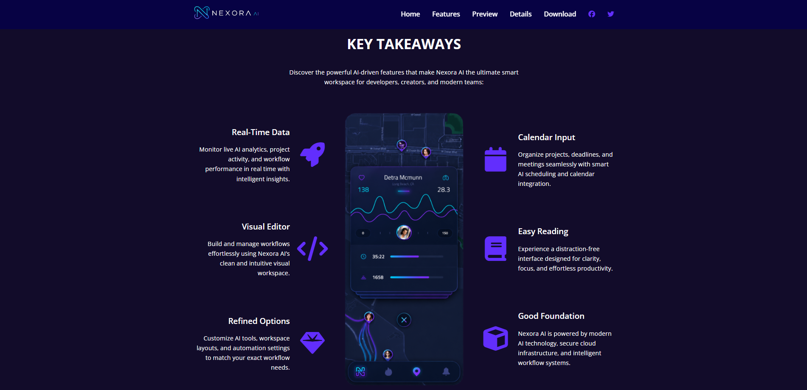
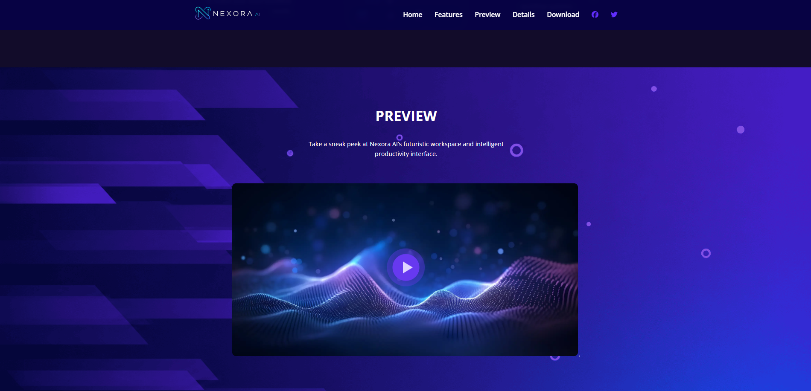
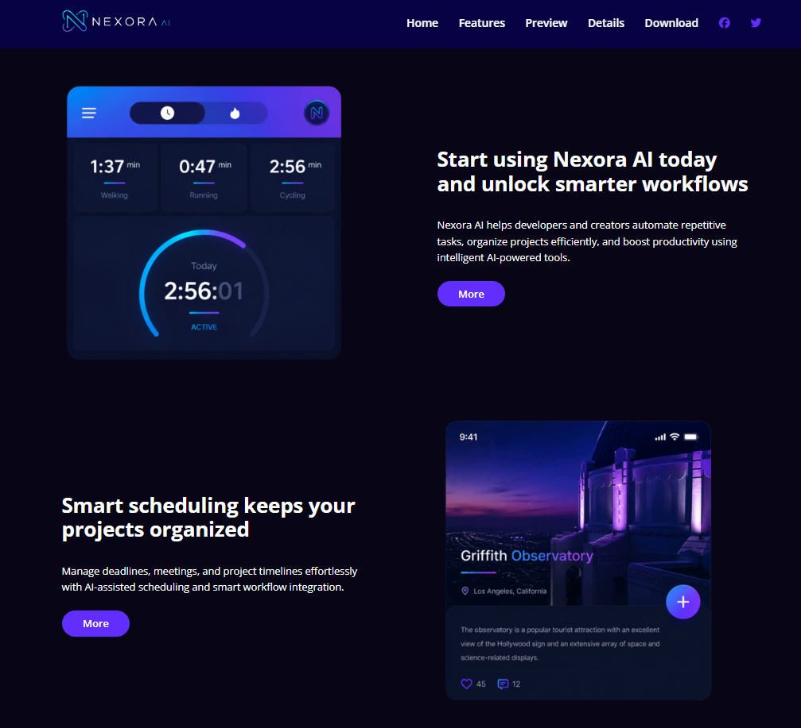
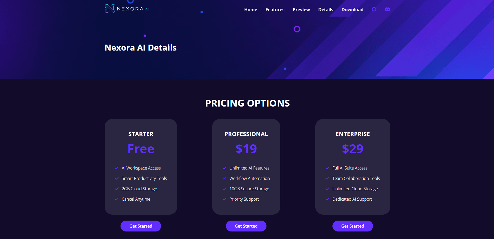
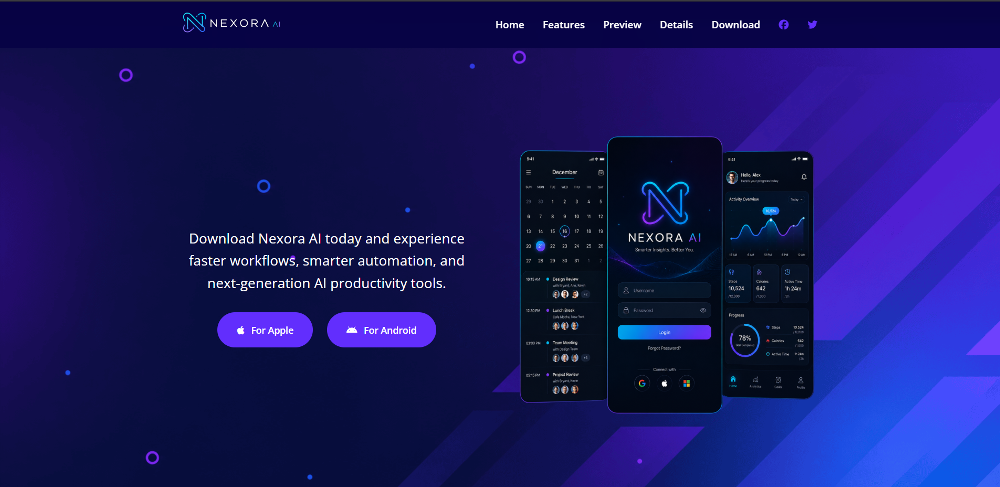
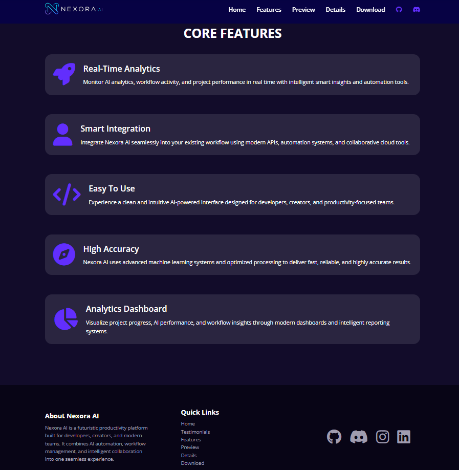

# Nexora AI - Futuristic AI Workspace

---

# Overview

**Nexora AI** is a futuristic and responsive AI workspace landing page built for developers, creators, startups, and modern productivity-focused teams.

The project is designed using **HTML5**, **CSS3**, and **Vanilla JavaScript**, featuring a modern dark neon interface, AI-inspired visuals, responsive layouts, smooth interactions, and organized reusable components.

Nexora AI showcases smart workflow automation, intelligent analytics, productivity dashboards, scheduling systems, AI-powered collaboration, and futuristic UI/UX design aesthetics.

---

# Live Demo

### Website Link

---

# Features

- Futuristic AI-Inspired UI Design
- Fully Responsive Website
- Sticky Navbar with Scroll Effects
- Mobile Hamburger Navigation
- Interactive Video Preview Modal
- AI Workspace Hero Section
- Smart Workflow Showcase
- Core Features Section
- Dashboard & Analytics UI
- Pricing Plans Section
- Download CTA Section
- Smooth Hover Animations
- Gradient Buttons & Glow Effects
- Reusable CSS Architecture
- Optimized Layout Spacing
- Mobile & Tablet Responsive Design

---

# Technologies Used

## Frontend

- HTML5
- CSS3
- Vanilla JavaScript

## UI & Styling

- Google Fonts
- Font Awesome Icons
- Custom Gradient Effects
- Responsive Flexbox & Grid Layouts

## Development Tools

- VS Code
- Live Server Extension

---

# Website Sections

---

## Hero Section

The hero section introduces Nexora AI with:

- Futuristic productivity-focused branding
- Gradient typography
- Modern AI smartphone mockups
- Responsive CTA buttons
- AI-inspired background visuals

### Screenshot



---

## Features Section

Highlights the core AI functionalities including:

- Real-Time Analytics
- Smart Integration
- Visual Workflow Editor
- AI Scheduling
- Smart Productivity Tools
- Intelligent Dashboard Systems

### Screenshot



---

## Preview Section

Interactive preview section containing:

- AI-themed preview image
- Video popup modal
- Animated play button
- Futuristic visual aesthetics

### Screenshot



---

## Details Section

Detailed workspace and productivity overview featuring:

- AI workflow automation
- Smart scheduling tools
- Productivity optimization
- Collaboration systems

### Screenshot



---

## Pricing Section

Modern pricing cards designed for:

- Starter Plan
- Professional Plan
- Enterprise Plan

Each plan includes futuristic UI styling and responsive card layouts.

### Screenshot



---

## Download Section

Call-to-action section encouraging users to:

- Download Nexora AI
- Explore AI productivity tools
- Access smart workflow systems

### Screenshot



---

## Core Features Page

Dedicated details page showcasing advanced features:

- AI Analytics
- Smart Automation
- Dashboard Reporting
- Team Collaboration
- High Accuracy Systems

### Screenshot



---

# Folder Structure

```bash
Nexora-AI/
│
├── index.html
├── details.html
├── README.md
│
├── css/
│   └── styles.css
│
├── js/
│   └── script.js
│
├── images/
│   ├── logo.svg
│   ├── header-smartphones.png
│   ├── features-smartphone-1.png
│   ├── video-frame.png
│   ├── screenshot-1.png
│   ├── screenshot-2.png
│   ├── screenshot-3.png
│   ├── screenshot-4.png
│   ├── screenshot-5.png
│   └── ...
│
├── home.png
├── features.png
├── preview.png
├── details.png
├── pricing.png
├── download.png
└── corefeatures_footer.png
```

# Responsive Design

Nexora AI is fully optimized for:

- Desktop Devices
- Tablets
- Mobile Phones

The website uses responsive Flexbox and Grid systems to ensure smooth layouts across all devices.

---

# UI Highlights

- Modern Dark Neon Interface
- Purple & Blue AI Gradients
- Glassmorphism Inspired Elements
- Responsive Navigation Bar
- Scroll Blur Navbar Effect
- Interactive Video Modal
- Animated Hover Effects
- Modern Pricing Cards
- Smooth Spacing & Typography
- AI-Themed Visual Components

---

# Future Improvements

- AI Chat Assistant Integration
- Authentication System
- Backend API Connectivity
- Dashboard Functionality
- Light/Dark Theme Toggle
- Real-Time Collaboration Features
- Advanced Motion Animations

---

# Author

## Adib Ahmed

Software & AI/ML Engineer  
Bangladesh Software Solution (BSS)

---

# License

This project is open-source and available under the **MIT License**.
