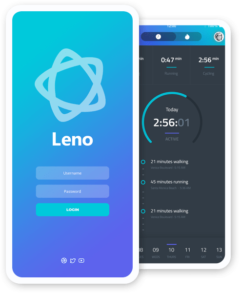
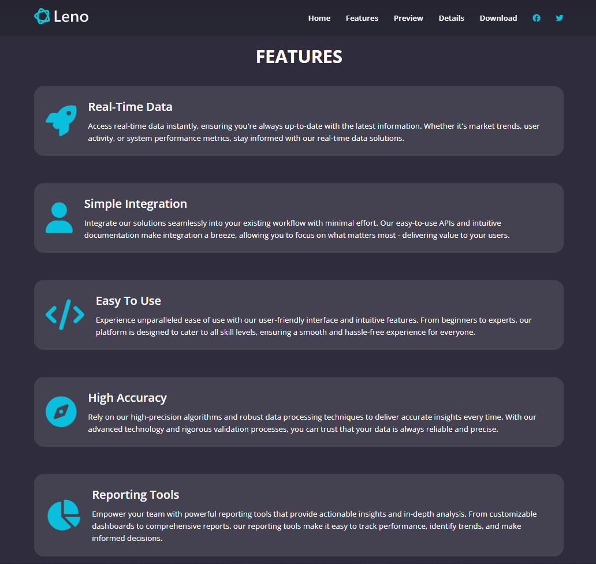

# Leno - Productivity & Health App Landing Page



## Overview

**Leno** is a modern and responsive landing page website for a productivity & health mobile application.  
Built using **HTML**, **CSS**, and **JavaScript**, the project focuses on clean UI/UX, responsive layouts, smooth interactions, and modern design aesthetics.

The website showcases app features, previews, pricing plans, testimonials, screenshots, and download sections in a visually engaging way.

---

## Live Demo

**Live Website:**

---

## Features

- Modern Responsive UI Design
- Smooth Navigation & Mobile Menu
- Interactive Video Preview Modal
- Beautiful Hero Section
- Features & Highlights Section
- Testimonials Section
- App Screenshots Gallery
- Pricing Plans Section
- Download CTA Section
- Fully Responsive Design
- Clean & Organized Code Structure

---

## Technologies Used

- HTML5
- CSS3
- Vanilla JavaScript
- Font Awesome
- Google Fonts

---

# Website Screenshots

## Home Section


---

## Features Section


---

## Preview Section


---

## Details Section


---

## Download Section


---

## Pricing Options


---

## Details Features Page



---

# 📂 Project Structure

```bash
Leno/
│
├── index.html
├── details.html
├── css/
│   └── styles.css
├── js/
│   └── script.js
├── images/
│   ├── header-smartphones.png
│   ├── features-smartphone-1.png
│   ├── screenshot-1.png
│   ├── screenshot-2.png
│   ├── screenshot-3.png
│   ├── screenshot-4.png
│   ├── screenshot-5.png
│   └── ...
```

---

# Installation & Setup

Clone the repository:

```bash
git clone https://github.com/your-username/leno.git
```

Navigate to the project folder:

```bash
cd leno
```

Run the project:

```bash
Open index.html
```

Or use the VS Code Live Server extension.

---

# Responsive Design

Leno is fully responsive and optimized for:

- Desktop
- Tablet
- Mobile Devices

---

# Highlights

- Elegant modern dark UI
- Smooth hover effects
- Scroll-based navbar effect
- Responsive hamburger menu
- Embedded video modal
- Organized reusable CSS structure

---

# Author

**Adib Ahmed** - AI Engineer Intern - Bangladesh Software Solution (BSS)

---

# License

This project is open-source and available under the **MIT License**.
