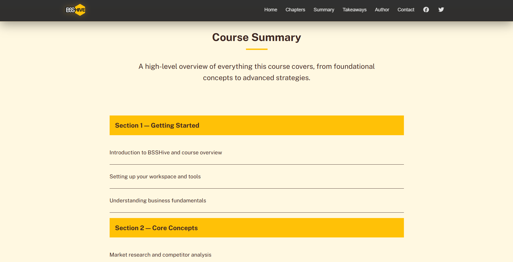
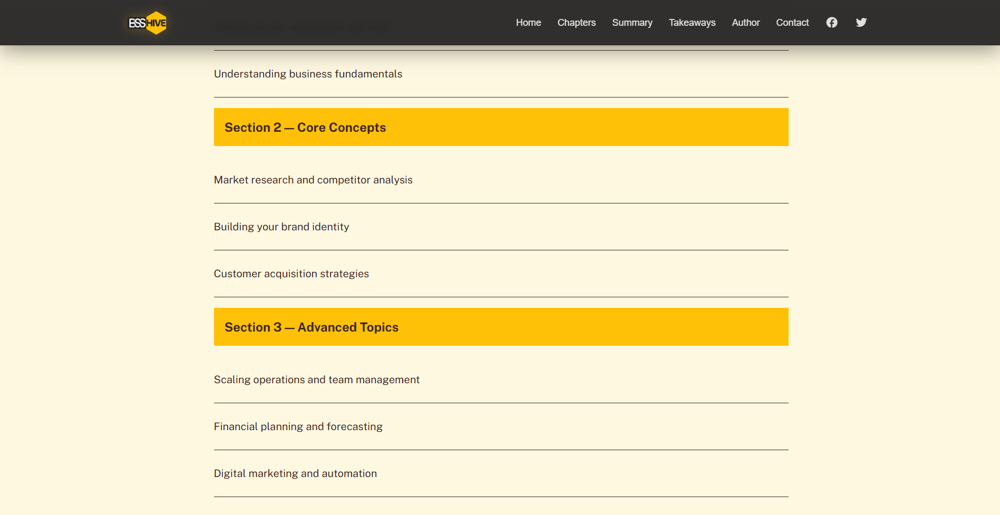
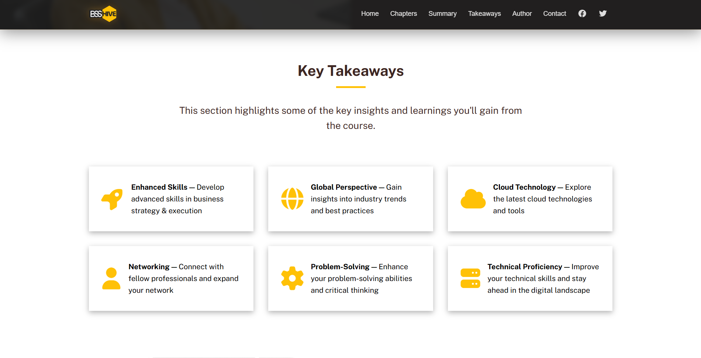

# BSSHive

A modern and responsive business course landing page built using **HTML5, CSS3, and JavaScript**.

BSSHive is designed with a premium black-and-yellow branding style focused on showcasing online business courses, learning materials, summaries, chapters, newsletters, and contact functionality.

Developed by **Adib Ahmed** during internship at **Bangladesh Software Solution (BSS)**.

---

# Live Demo

🔗 https://bsshive.vercel.app/

> Replace this URL with your Netlify / Vercel / GitHub Pages deployment link.

---

# Website Preview

## Hero Section


---

## What Will You Learn?


---

## Main Course Chapters


---

## Course Summary





---

## Key Takeaways



---

## Course Details & Author Section


---

## Stats & Newsletter Section


---

## Who Is This Course For?


---

## Footer & Social Media Section


---

# Features

- Fully Responsive Website
- Modern Premium UI/UX
- Black & Yellow Branding Theme
- Mobile Navigation Menu
- Smooth Navbar Scroll Effect
- Business Course Showcase
- Interactive Sections
- Newsletter Subscription UI
- Embedded Google Maps
- Contact Form Integration
- Social Media Links
- Responsive Flexbox Layout
- Reusable Components
- Mobile-Friendly Design

---

# Technologies Used

## Frontend

- HTML5
- CSS3
- JavaScript (Vanilla JS)

---

## Libraries & Tools

- Font Awesome Icons
- Google Fonts
- Formspree
- Google Maps Embed API

---

## Design & Development

- Responsive Web Design
- Flexbox Layout System
- Custom UI Styling
- Mobile-First Adjustments

---

# 📂 Project Structure

```bash
BSSHive/
│
├── css/
│   └── styles.css
│
├── js/
│   └── script.js
│
├── images/
│   ├── logo.svg
│   ├── header-course.png
│   ├── author.png
│   ├── details.png
│   └── ...
│
├── index.html
├── contact.html
└── README.md
```
