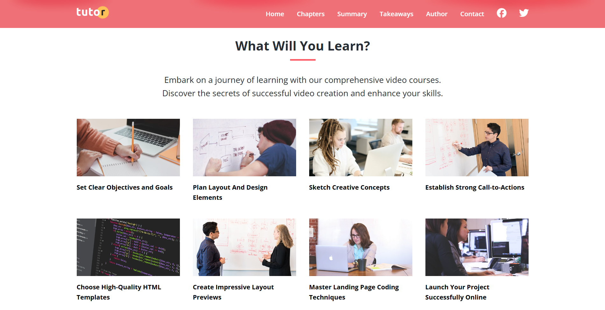
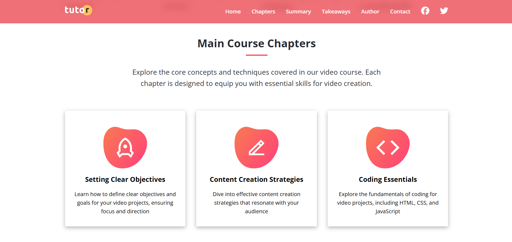
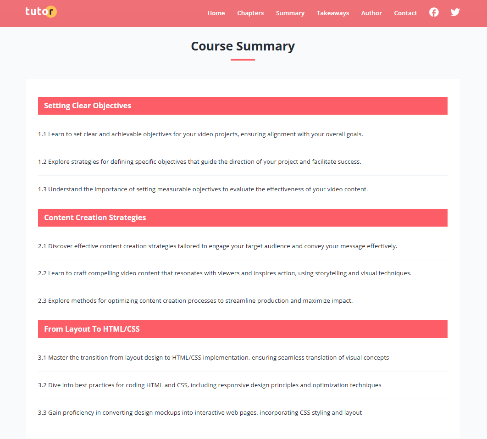
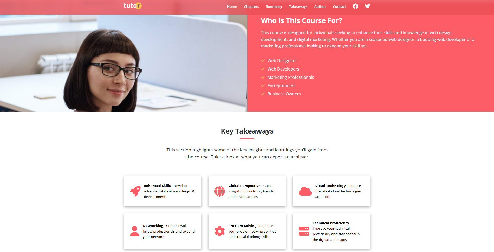
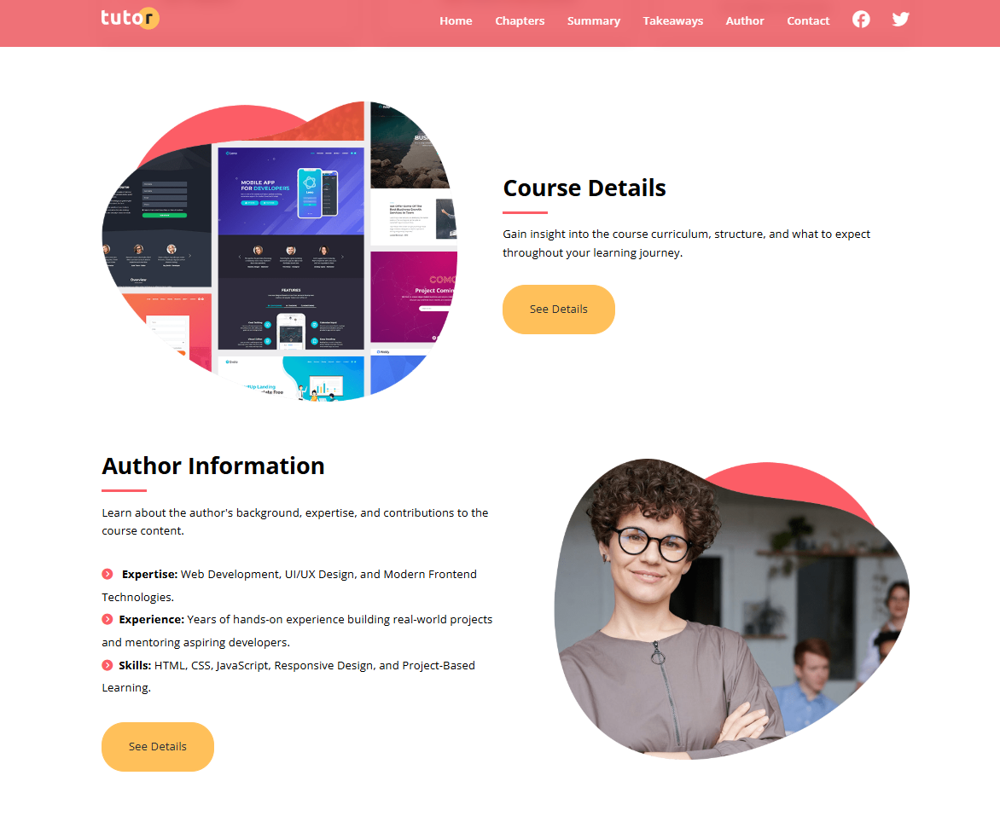
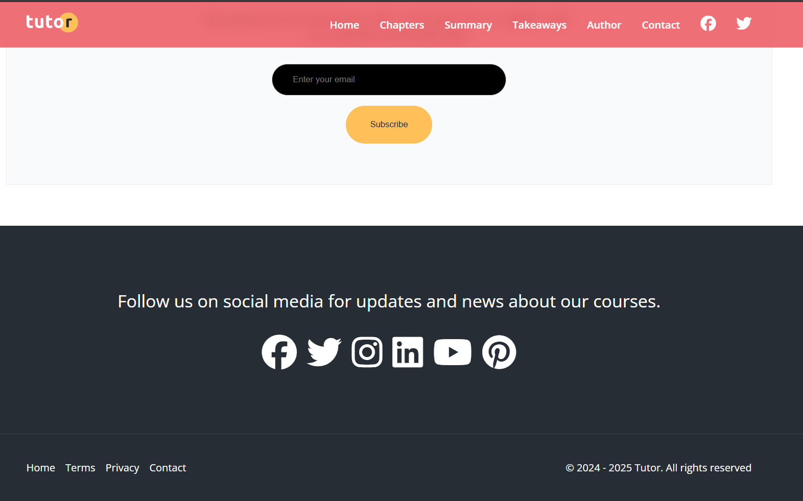

# 🎓 Tutor - Video Course Landing Page

A modern and responsive video course landing page built using **HTML, CSS, and JavaScript**.  
This project showcases a clean UI design for promoting online video courses with engaging sections, responsive layouts, and interactive components.

---

## Live Features

- Responsive Landing Page Design
- Smooth Scrolling Navigation
- Mobile Navigation Menu
- Course Chapters Section
- Course Summary & Takeaways
- Author Information Section
- Newsletter Subscription Form
- Contact Page with Formspree Integration
- Social Media Footer
- Modern UI/UX Layout

---

## Technologies Used

- HTML5
- CSS3
- JavaScript (Vanilla JS)
- Font Awesome
- Google Fonts

---

# Website Preview

## Home Section


---

## What Will You Learn



---

## Main Course Chapters



---

## Course Summary



---

## Key Takeaways



---

## Author Information



---

## Statistics & Newsletter


---

## Footer Section



---

# Author

## Adib Ahmed

Software & AI/ML Enthusiast  
Intern at **Bangladesh Software Solution (BSS)** 🇧🇩

Passionate about:

- Web Development
- Artificial Intelligence & Machine Learning
- Frontend Design
- Building Modern Responsive Websites

---

# 📂 Project Structure

```bash
Tutor/
│
├── css/
│   └── styles.css
│
├── js/
│   └── script.js
│
├── images/
│
├── index.html
├── contact.html
└── README.md
```
